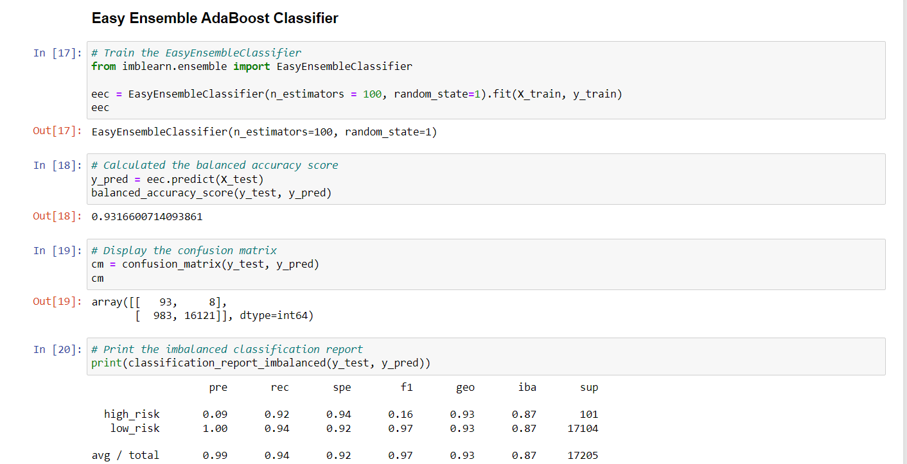

# Credit_Risk_Analysis

## Overview of the analysis
### Purpose of this analysis
The objective of this analysis was to use several different machine learning models to evaluate credit risk. A large data set of credit applications was imported, which included a large number of potential features that could be used to predict which loans would be considered risky. Each learning model was trained on a subset of the data, then tested and evaluated for its accuracy, precision, and recall. The ulitmate objective was to recommend which of the models, if any, would be best suited to evaluating the risk level of future credit applications.

## Results
### Naive Oversampling
The naive oversampling model produced these results:

- The balanced accuracy score was 0.646
- The precision was 0.01 for the "positive" group of high-risk loans--a particularly troublesome result; the model predicted far more high-risk loans than there actually were.
- The recall was 0.71 for the "positive" group of high-risk loans.

### SMOTE Oversampling
SMOTE resampling produced these results:

- The balanced accuracy score was 0.658
- The precision was 0.01 for the "positive" group of high-risk loans, again indicating that the model's predictions of high risk were very aggressive.
- The recall was 0.63 for the "positive" group of high-risk loans.

### Undersampling with Cluster Centroids
The undersampling model using Cluster Centroids produced these results:

- The balanced accuracy score was 0.544
- The precision was 0.01 for the "positive" group of high-risk loans.
- The recall was 0.69 for the "positive" group of high-risk loans.

### SMOTEENN
The SMOTEENN algorithm produced these results:

- The balanced accuracy score was 0.666
- The precision was 0.01 for the "positive" group of high-risk loans.
- The recall was 0.73 for the "positive" group of high-risk loans.

### BRFC
The Balanced Random Forest model produced these results:

- The balanced accuracy score was 0.788, a marked improvement over the previous resampling models.
- The precision was 0.03 for the "positive" group of high-risk loans, marking the first model with a precision above 0.01.
- The recall was 0.70 for the "positive" group of high-risk loans.

### Easy Ensemble
The Easy Ensemble model produced these results:

- The balanced accuracy score was 0.931, by far the best of the models tested.
- The precision was 0.09 for the "positive" group of high-risk loans.
- The recall was 0.92 for the "positive" group of high-risk loans.

## Summary

### Summary of the model results
All the featured resampling models performed similarly, with balanced accuracy scores below 70%. While their recall rates indicate that they identified the majority of the high-risk loans, many of them still allowed 25% or more of the high-risk loans in the test set to avoid being flagged. Additionally, they also threw out considerable numbers of loans flagged as high-risk that were in fact low-risk.

Ultimately, while none of the models were necessarily precise, it is the case that sensitivity may be more important in this context. The consequences of denying a loan that would have been low-risk are limited to missing the opportunity to turn a profit, whereas mistakenly granting a high-risk loan can be much more damaging. 

### Recommendation for which model to use
The ensemble models were by far the most effective in terms of precision, and the EasyEnsemble boosted classifier had the added benefit of an accuracy score above 90%. Even though its precision is still low in absolute terms, its strong recall indicates that it only rarely fails to flag a high-risk application when one is given. For this reason, I would recommend the EasyEnsemble classifier to be used to predict credit risk going forward.

